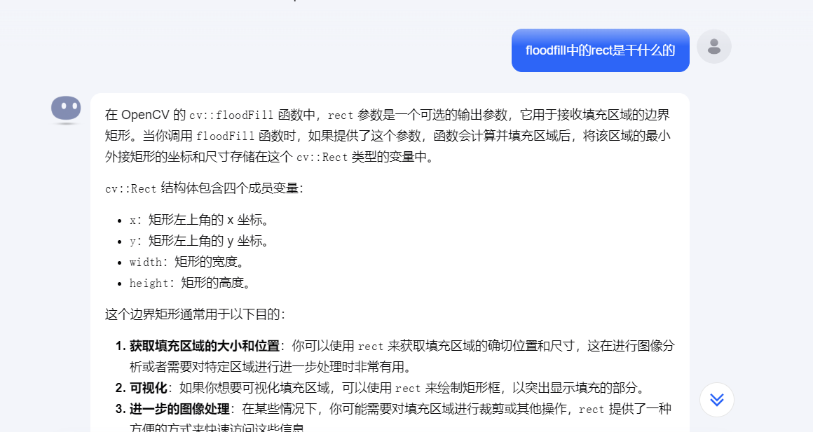
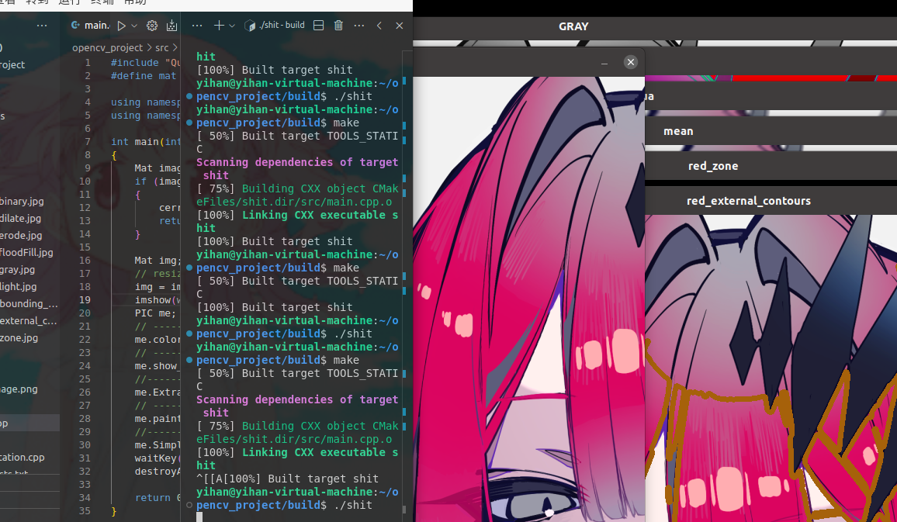

# Done but not perfect
- ### cmake的配置参考*同济大学SuperPower战队*的教程
> https://www.bilibili.com/video/BV1N3tTeoEqx/?spm_id_from=333.788&vd_source=91576311775dfd056d5648edb481cddf
- ### opencv编程部分参考*B站UESTC_晨光*的教程
> https://www.bilibili.com/video/BV1Fq4y1r7b1?p=110&vd_source=91576311775dfd056d5648edb481cddf
- ### 当然后期少不了*Kimi*的帮助
#### like this:

#### Task instruction: 由于把握不了红色的范围以及细节和噪点之间的balance，一些细节在计算轮廓面积时被消除了，但总体看起来还是可以的。

#### Homework innstruction:
#### 1.寻找红色轮廓与计算轮廓面积的操作一并在task3中完成，故task4中只有paint，
#### 2.所有处理好的图像都放在/resouces/dst文件夹里了
#### 3.terminal picture:
